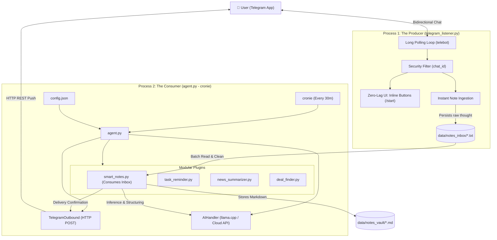
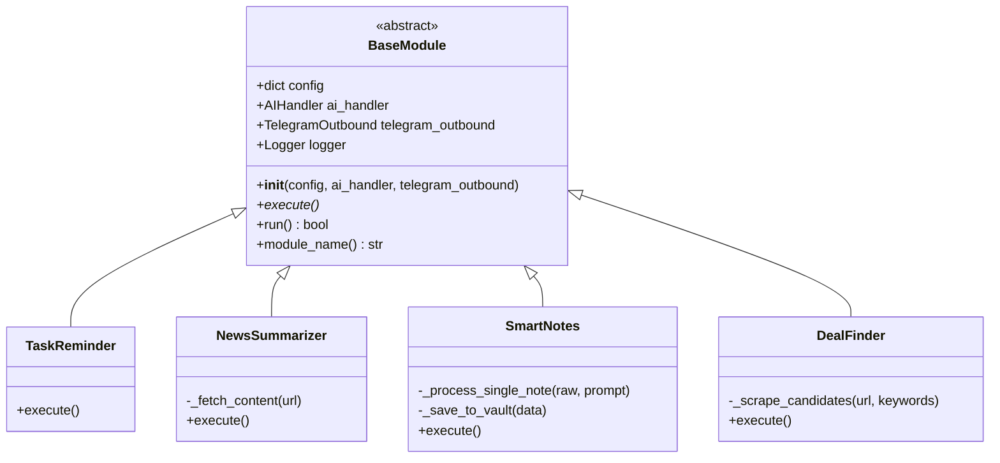

# 📱 r3scue-me

> **Transform retired Android smartphones into autonomous, edge-computing AI automation servers.**  
> Native Termux support, modular architecture, local `llama.cpp` or cloud API inference, and zero-registration push notifications via `ntfy`.

[](LICENSE)
[](#)
[](#)
[](#)

---

## 📑 Table of Contents

1. [Architectural Overview](#-architectural-overview)
2. [Prerequisites & Phone Preparation](#-prerequisites--phone-preparation)
3. [Quick Start (Installation)](#-quick-start-installation)
4. [Configuration Reference (`config.json`)](#-configuration-reference-configjson)
5. [Built-in Modules](#-built-in-modules)
6. [Developer Guide: Creating Custom Modules](#-developer-guide-creating-custom-modules)
7. [SOLID Design Principles in Action](#-solid-design-principles-in-action)
8. [Troubleshooting & FAQ](#-troubleshooting--faq)
9. [License](#-license)

---

## 🏛 Architectural Overview: Dual-Process (Producer-Consumer)

DroidServer-AI uses a **Dual-Process (Producer-Consumer)** design pattern to achieve zero-latency UX on mobile while protecting the Android device's limited RAM from heavy continuous LLM loads:

1. **The Producer (`telegram_listener.py`)**: Runs continuously via long-polling using `pyTelegramBotAPI`. It has **strict zero-AI imports** and a memory footprint of ~15-20 MB. It responds instantly to `/start` with interactive inline buttons and persists incoming thoughts/notes into `data/notes_inbox/note_<timestamp>.txt`.
2. **The Consumer (`agent.py`)**: Runs on a periodic schedule (via `cronie`). It initializes `AIHandler` and `TelegramOutbound`, scans the inbox, runs heavy inference (via native `llama.cpp` or API), archives structured Markdown in `data/notes_vault/`, and sends notifications directly to the user's Telegram chat.



### Module Class Hierarchy



---

## 📱 Prerequisites & Phone Preparation

To ensure maximum stability, zero thermal throttling, and uninterrupted background execution on an old Android phone, follow these preparation steps:

### 1. Perform a Factory Reset (Hard Reset)
* Wipe the phone to factory defaults to eliminate OEM bloatware, background battery drains, and vendor services.
* Skip configuring Google accounts during setup unless strictly required.

### 2. Install Termux via F-Droid (**Crucial**)
> [!IMPORTANT]
> **NEVER install Termux from Google Play Store.**  
> The Google Play build was deprecated in 2020 due to Android SDK restrictions and has broken package mirrors (`404 Not Found` errors).  
> Always install from [F-Droid](https://f-droid.org/packages/com.termux/) or GitHub Releases.

Also install:
* [Termux:API (F-Droid)](https://f-droid.org/packages/com.termux.api/)
* [Termux:Boot (F-Droid)](https://f-droid.org/packages/com.termux.boot/) *(optional, for auto-start on boot)*

### 3. Disable Battery Optimizations (Doze Mode)
Android aggressively kills background processes if battery optimization is enabled:
1. Open Android **Settings** → **Apps** → **Termux** → **Battery**.
2. Set to **Unrestricted** (or disable *Battery Optimization*).
3. If using Samsung, Xiaomi, or Huawei, disable aggressive vendor task killers (see [dontkillmyapp.com](https://dontkillmyapp.com)).

### 4. Hardware & Power Management
* **Keep phone connected to power**: A standard 5V/1A or 5V/2A low-power wall charger is ideal.
* **Battery Longevity Tip**: If rooted, use `acc` (Advanced Charging Controller) to cap battery charge at 70-80% to avoid battery swelling over months of continuous operation.

---

## 🚀 Quick Start (Installation)

### 1. Launch Termux and Clone Repository

```bash
pkg update -y && pkg install -y git
git clone https://github.com/your-username/r3scue-me.git
cd r3scue-me
```

### 2. Run Automated Setup Script

```bash
chmod +x install.sh
./install.sh
```

The installer handles:
1. Acquiring `termux-wake-lock` to keep the CPU awake.
2. Installing native toolchains: `python`, `clang`, `cmake`, `git`, `cronie`.
3. Creating and configuring an isolated Python virtual environment (`.venv`) so global host packages are never touched.
4. Selecting AI backend:
   * **Cloud API**: Prompts for your OpenAI/OpenRouter/Groq API key.
   * **Local native llama.cpp**: Audits RAM with `free -m`, compiles `llama.cpp` natively with Clang (no `proot-distro` performance overhead), and downloads an optimized GGUF model (e.g. Qwen2.5 0.5B or 1.5B).
5. Configuring your unique `ntfy` topic for push alerts.
6. Setting up the crontab daemon (`cronie`) to run every 30 minutes in the background using `.venv/bin/python`.

### 3. Manual Setup (Alternative)

If you prefer setting up the environment manually:

```bash
# 1. Create and activate isolated virtual environment
python -m venv .venv
source .venv/bin/activate       # On Linux / Termux
# .venv\Scripts\activate       # On Windows

# 2. Install dependencies strictly inside .venv
pip install --upgrade pip
pip install -r requirements.txt
```

### 4. Running & Testing

Always activate your virtual environment before running manual commands:

```bash
source .venv/bin/activate       # On Linux / Termux
# .venv\Scripts\activate       # On Windows
```

Execute a run:

```bash
python agent.py
```

List all available modules:

```bash
python agent.py --list-modules
```

Run a specific module directly:

```bash
python agent.py --module news_summarizer
```

---

## ⚙️ Configuration Reference (`config.json`)

The entire runtime behavior is driven by `config.json`. Below is a comprehensive example:

```json
{
  "ai": {
    "mode": "api",
    "api": {
      "base_url": "https://openrouter.ai/api/v1",
      "api_key": "sk-or-v1-xxxxxxxxxxxx",
      "model": "qwen/qwen-2.5-7b-instruct",
      "timeout_seconds": 60
    },
    "local": {
      "binary_path": "/data/data/com.termux/files/home/llama.cpp/build/bin/llama-cli",
      "model_path": "/data/data/com.termux/files/home/r3scue-me/models/qwen2.5-0.5b-instruct-q4_k_m.gguf",
      "threads": 4,
      "context_size": 2048,
      "timeout_seconds": 180
    }
  },
  "telegram": {
    "bot_token": "123456789:ABCdefGHIjklMNOpqrsTUVwxyz",
    "chat_id": "987654321",
    "timeout_seconds": 15
  },
  "active_modules": [
    "smart_notes"
  ],
  "modules": {
    "task_reminder": {
      "tasks": [
        "Review Pull Request #42 on GitHub",
        "Backup Termux data to NAS"
      ]
    },
    "news_summarizer": {
      "urls": [
        "https://news.ycombinator.com/rss",
        "https://feeds.arstechnica.com/arstechnica/index"
      ]
    },
    "smart_notes": {
      "inbox_dir": "data/notes_inbox",
      "vault_dir": "data/notes_vault"
    },
    "deal_finder": {
      "urls": [
        "https://news.ycombinator.com/show"
      ],
      "keywords": [
        "open source",
        "database",
        "release"
      ]
    }
  }
}
```

---

## 🎛️ Telegram Interactive Control Center

The Producer process (`telegram_listener.py`) provides an interactive dashboard inside Telegram with zero latency and zero continuous AI load. Sending `/start` presents an inline keyboard providing instant status checks for all configured modules:

```text
┌─────────────────┬─────────────────┐
│     📝 Notas    │    📋 Tareas    │
├─────────────────┼─────────────────┤
│   📰 Noticias   │    🔥 Chollos   │
├─────────────────┴─────────────────┤
│         ⚡ Estado Servidor         │
└───────────────────────────────────┘
```

| Interactive Action | Callback Data | Description |
| :--- | :--- | :--- |
| **📝 Notas** | `cmd_view_notes` | Reports the count of raw `.txt` notes waiting in `data/notes_inbox/` plus the list of organized `.md` notes currently in `data/notes_vault/`. |
| **📋 Tareas** | `cmd_view_tasks` | Reads and lists current pending tasks from `config.json` in real time. |
| **📰 Noticias** | `cmd_view_news` | Displays all monitored RSS feeds and news URLs configured for the daily digest. |
| **🔥 Chollos** | `cmd_view_deals` | Displays the keywords tracked and e-commerce/forum search URLs monitored by DealFinder. |
| **⚡ Estado Servidor** | `cmd_view_status` | Returns a live diagnostic card: active AI backend (`API` or `LOCAL`), model name, active cron modules, and listener RAM usage (~18 MB). |
| **Direct Note Ingestion** | `<any text>` | Any text message sent to the bot is instantly saved to `data/notes_inbox/note_<timestamp>.txt` for batch processing in the next cron run. |

---

## 📦 Built-in Modules

| Module | Identifier | Description | Dependencies |
| :--- | :--- | :--- | :--- |
| **Smart Notes** | `smart_notes` | Consumes raw `.txt` notes created by `telegram_listener.py`, categorizes them with AI, and stores structured Markdown in `data/notes_vault/`. | Core |
| **Task Reminder** | `task_reminder` | Prioritizes daily tasks via the Eisenhower Matrix, detects blockers, and pushes an actionable morning briefing to Telegram. | Core |
| **News Summarizer** | `news_summarizer` | Scrapes RSS/Atom feeds and static web pages, using AI to distill an executive 3-5 bullet point digest. | `feedparser`, `bs4` |
| **Deal Finder** | `deal_finder` | Scrapes listings using lightweight static HTML parsing (no Selenium/Chromium) and uses AI to discard false positives. | `bs4`, `requests` |

---

## 🛠 Developer Guide: Creating Custom Modules

DroidServer-AI was designed from the ground up for open-source extension. Any new module requires just a single `.py` file placed in the `modules/` directory.

### Step 1: Subclass `BaseModule`

Create `modules/system_health.py`:

```python
"""
modules/system_health.py - Custom System Health Monitoring Module.
"""

import shutil
from typing import Any, Dict
from core.base_module import BaseModule
from core.ai_handler import AIHandler
from core.telegram_outbound import TelegramOutbound


class SystemHealth(BaseModule):
    """
    Monitors device storage and memory, using AI to recommend cleanup steps.
    """

    def __init__(
        self,
        config: Dict[str, Any],
        ai_handler: AIHandler,
        telegram_outbound: TelegramOutbound
    ) -> None:
        super().__init__(config, ai_handler, telegram_outbound)
        self.module_cfg = self.config.get("modules", {}).get("system_health", {})

    def execute(self) -> None:
        # 1. Collect low-overhead system metrics
        total, used, free = shutil.disk_usage("/")
        free_gb = free // (2**30)
        total_gb = total // (2**30)

        self.logger.info(f"System storage: {free_gb} GB free of {total_gb} GB.")

        # 2. Consult AI for health assessment
        prompt = (
            f"A server running on an Android device reports {free_gb} GB free out of {total_gb} GB total disk. "
            f"Provide a 2-line diagnostic and maintenance recommendation."
        )

        analysis = self.ai_handler.prompt(
            user_prompt=prompt,
            system_prompt="You are a Linux sysadmin. Keep advice ultra-concise.",
            max_tokens=150
        )

        # 3. Dispatch outbound Telegram message
        self.telegram_outbound.send_message(
            text=f"📊 *Server Health Status*\n\nStorage: {free_gb}GB / {total_gb}GB free.\n\n*AI Diagnostic:*\n{analysis}",
            parse_mode="Markdown"
        )
```

### Step 2: Register in `config.json`

Add the module identifier to `active_modules`:

```json
{
  "active_modules": [
    "system_health"
  ],
  "modules": {
    "system_health": {}
  }
}
```

### Step 3: Run It!

```bash
source .venv/bin/activate
python agent.py --module system_health
```

The orchestrator dynamically imports the file, verifies that it is a subclass of `BaseModule`, injects the dependencies, and executes it with structured logging and error traps.

---

## 💎 SOLID Design Principles in Action

* **S (Single Responsibility Principle)**:
  * `telegram_listener.py` (Producer) handles only Telegram polling, inline UI responses, and note ingestion into `data/notes_inbox/`. Zero AI.
  * `TelegramOutbound` handles only HTTP REST message delivery to Telegram.
  * `AIHandler` handles only model communication and payload formatting.
  * Each module in `modules/` handles only its specific domain logic.
* **O (Open/Closed Principle)**:
  * Adding new features does not require altering `agent.py`, `telegram_listener.py`, or `core/`. New capabilities are added solely by dropping new classes into `modules/`.
* **L (Liskov Substitution Principle)**:
  * Any module inheriting from `BaseModule` can replace any other module seamlessly without modifying the orchestrator's dispatch logic.
* **I (Interface Segregation Principle)**:
  * `BaseModule` exposes only the essential abstract contract (`execute`) and wrapper methods (`run`), avoiding bloated interfaces.
* **D (Dependency Inversion Principle)**:
  * Modules depend on abstractions (`AIHandler`, `TelegramOutbound`), not concrete low-level implementations.

---

## ❓ Troubleshooting & FAQ

### 1. `termux-wake-lock: command not found`
Ensure you have installed the **Termux:API** package from F-Droid, and run `pkg install termux-api`.

### 2. How do I get my Telegram Bot Token and Chat ID?
* Message **@BotFather** on Telegram and type `/newbot` to get your `bot_token`.
* Message **@userinfobot** on Telegram to obtain your numeric `chat_id`.

### 3. Background process stopped after several hours
Check whether Android put Termux to sleep:
* Run `termux-wake-lock` again.
* Ensure battery optimization is disabled for both **Termux** and **Termux:API**.
* Check listener logs with `tail -f telegram_listener.log`.

---

## 📄 License

This project is licensed under the [MIT License](LICENSE). Contributions, PRs, and issues are welcome!
